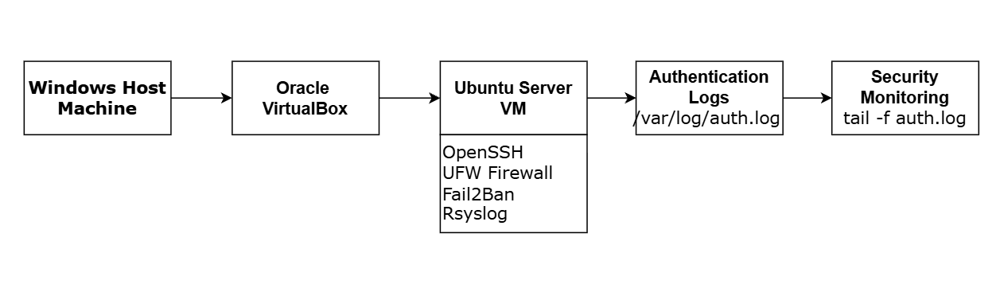
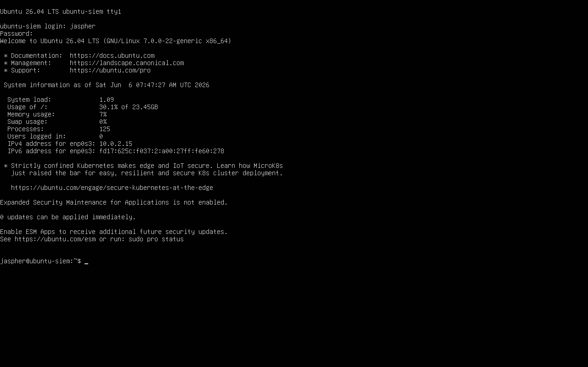
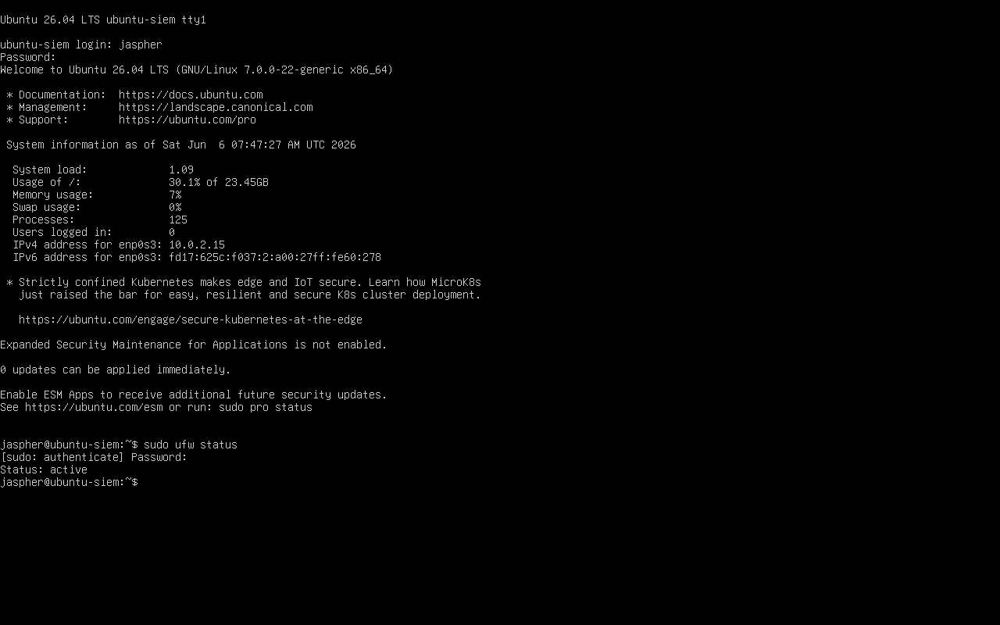
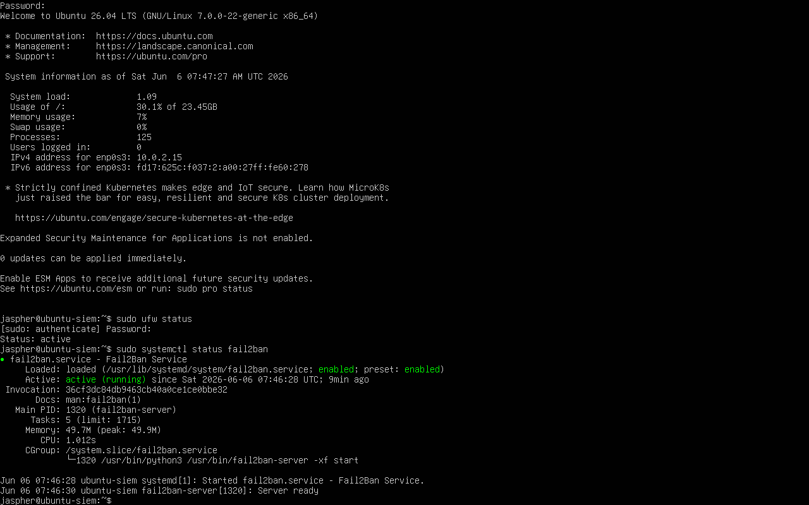
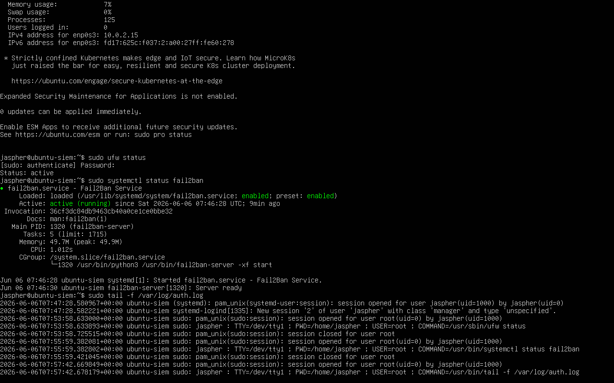
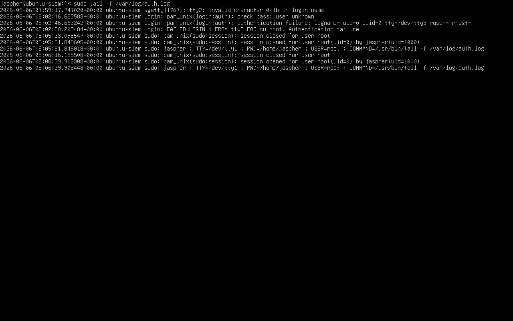
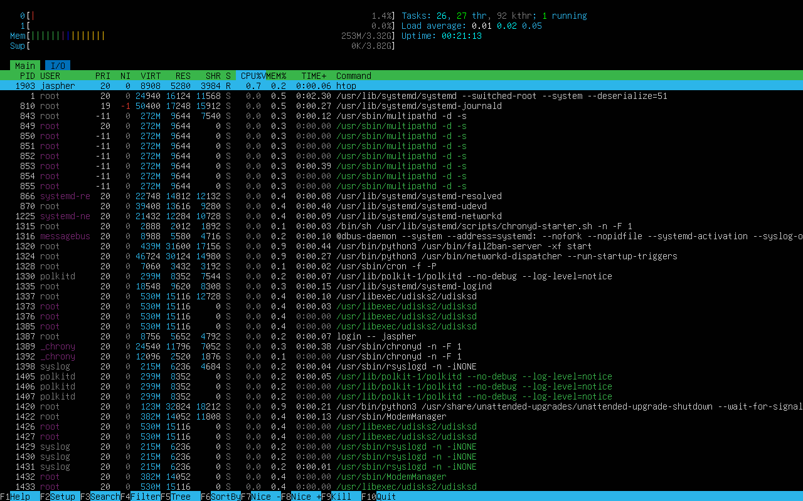

# Linux Server Hardening and Security Monitoring Lab

## Project Overview

This project demonstrates the deployment, hardening, and monitoring of an Ubuntu Server in a virtualized environment. The objective was to gain hands-on experience in Linux administration, cybersecurity monitoring, log analysis, firewall management, and intrusion prevention.

## Objectives

- Deploy Ubuntu Server using VirtualBox
- Configure OpenSSH for remote administration
- Implement firewall protection using UFW
- Configure Fail2Ban intrusion prevention
- Monitor authentication logs
- Simulate unauthorized access attempts
- Detect and analyze security events

## Technologies Used

- Ubuntu Server
- Oracle VirtualBox
- UFW Firewall
- Fail2Ban
- OpenSSH
- Rsyslog
- Linux Terminal

## Skills Demonstrated

- Linux Administration
- Security Monitoring
- Log Analysis
- Incident Detection
- Firewall Management
- Intrusion Prevention
- Virtualization

## Architecture Diagram



## Screenshots

### Ubuntu Login



### UFW Firewall Active



### Fail2Ban Running



### Authentication Log Monitoring



### Failed Login Event Detection



### System Monitoring



## Security Event Simulation

A failed privilege escalation attempt was simulated using:

```bash
su root
```

An incorrect password was intentionally entered.

The event was detected in real-time through:

```bash
sudo tail -f /var/log/auth.log
```

## Key Outcome

Successfully deployed and secured a Linux server while implementing security monitoring and detecting authentication failures through log analysis.

## Future Improvements

- Deploy ELK Stack
- Centralized Log Collection
- Multi-VM Security Lab
- SIEM Dashboard
- Threat Detection Rules
